# BOSS Architecture Diagrams

Four views of the system, ordered from conceptual to concrete. Each
diagram is authored as Mermaid source in `docs/architecture/*.mmd`
and rendered to SVG + PNG alongside. Regenerate with:

```bash
for f in 00-state-surfaces-work 01-primitives 02-service-map 03-deployment; do
  npx -y -p @mermaid-js/mermaid-cli@latest mmdc \
    -i docs/architecture/${f}.mmd \
    -o docs/architecture/${f}.svg -b transparent \
    -p docs/architecture/puppeteer-config.json
  npx -y -p @mermaid-js/mermaid-cli@latest mmdc \
    -i docs/architecture/${f}.mmd \
    -o docs/architecture/${f}.png -b white \
    -p docs/architecture/puppeteer-config.json -w 2400
done
```

(The shared `puppeteer-config.json` is committed at
`docs/architecture/puppeteer-config.json` and just passes
`--no-sandbox` args. Puppeteer auto-discovers Chrome in its default
cache; if your environment doesn't have one, it'll install on first
run.)

After regenerating, mirror the updated SVGs into the web app so the
in-app `/system/kb` (IT Knowledge Base) view picks them up:

```bash
cp docs/architecture/{00-state-surfaces-work,01-primitives,02-service-map,03-deployment}.svg \
   apps/web/src/it/kb-assets/
```

Rebuild + redeploy the web bundle (`bun run build && sudo
./infra/deploy-web.sh`) to push the updated diagrams to the browser.

---

## 0. The framing — State · Surfaces · Work

**BOSS models the whole company as a software system.** At the
highest level it splits into three things:

- **State** — what is true about the company right now (and what has
  happened). Subjects (tracked entities with event logs) + Knowledge
  Base (classes + types) + `audit_log` (the append-only source of
  truth) + Ledger projection (financial state).
- **Surfaces** — how humans see and act on the state. The web SPA,
  step-plugin bundles, the unified Messages inbox, the `boss` CLI.
- **Work** — how state changes. Jobs + Steps (coordination), the
  JobKind / StepPlugin / StepType registries (workflows as data),
  automation runners that turn events into work (`boss-dispatcher`
  step side-effect rules, `boss-cybernetics` agent runtime, tenant
  tick engines), and policy (row-level authorization as rows, not
  code).



This is MVC stretched to company scale, with one important caveat:
classic MVC's "Controller" is a thin router between Model and View.
BOSS's Work layer is a **substantive coordination layer** — Jobs
are stateful, registries are authoring surfaces, cybernetics reacts
to events with new work. So we use MVC only as a *shape* analogy;
the company-native vocabulary (State / Surfaces / Work) is clearer.

Every subsequent diagram zooms progressively inward from this
framing. Diagram 1 opens up the State + Work primitives. Diagram 2
shows the services that implement them. Diagram 3 shows where those
services run.

---

## 1. Primitives & cross-cutting abstractions

**The "why it stays simple" picture.** BOSS models every business
concept with four primitives, declares new work as registry data
instead of new code paths, puts hexagonal ports between domain and
infrastructure, and emits every state change as an immutable fact onto
a single event backbone.



**Load-bearing choices:**

- **Four primitives** (Subjects · Jobs · Steps · Events) carry the
  state-machine vocabulary. New entities are modeled as Subject kinds;
  new work as JobKinds; new transitions as StepTypes. The Class
  registry, StepPlugins, and Policy are supporting concepts on top.
- **Registries over match branches.** A new work type is a `job_kinds`
  row, a new step UX is a `step_plugins` row + a JS bundle. Zero core
  code changes. JobKinds are version-pinned so in-flight Jobs keep the
  graph they were opened under.
- **Hexagonal.** Each domain crate defines a port trait (`AssetsRepository`,
  `JobsRepository`, …) and never imports the Postgres / reqwest /
  in-memory adapters that implement it. The adapters are swappable;
  the domain doesn't know which one it got.
- **Event backbone.** Every primitive write emits an immutable fact
  through NATS and lands in `audit_log`. The log is the source of
  truth; projections rebuild from it. If current state disagrees with
  a replay, the log wins.
- **Cross-cutting rails.** Policy gates every write. Ledger projects
  `financial_facts` into the GL. Messages carries both direct messages
  and system signals on a unified inbox. Each rail is one crate that
  every domain can call through a client port — domains don't know
  about each other's data, only their own.

---

## 2. Service map

**"Which thing calls which thing."** Groups every shipped service by
role and shows how cross-service calls are shaped.



**How to read it:**

- **Edge** — the browser and CLI enter through `boss-gateway`, which
  serves the SPA, gates auth via the configured provider (`local-auth`
  for v0.1 — file-backed email/password credentials), and
  reverse-proxies to every `/api/*` route. The gateway is HTTP-only —
  TLS termination is the reverse proxy's job, not the gateway's.
- **Primitive services** (yellow) own the four primitives.
- **Domain services** (blue) own transactional slices — commerce,
  inventory, shipping, messages, people. Each has its own Postgres
  schema + event stream; no shared tables across services.
- **Cross-cutting services** (green) are universal rails — policy,
  ledger, content, ml, docs, sim. Called from many places but own
  their own narrow slice of data.
- **Runtime automation** (purple) subscribes to NATS and reacts to
  events — `boss-dispatcher` runs the step side-effect rules off
  `step.done.<kind>`, `boss-cybernetics` is the VSM agent runtime
  (per-VM inbox + budget caps + agent dispatch), `boss-observability`
  fans NATS out to browsers as SSE and serves health.
- **External adapters** (pink) are library crates, not services.
  They expose a port trait any service can consume. None ship in
  v1; future candidates: payroll, banks, shipping carriers, CRMs.
- **Cross-service client crates** are the narrow HTTP contract. If
  `boss-assets-api` needs to ask `boss-people-api` "does this employee
  exist," it calls `PeopleClient::employee_exists()` — a trait method
  on a tiny crate, backed by reqwest in prod and a fake in tests. No
  service ever talks to another service's database directly.

**Audit-tier overlay.**
The colour groups above are operational ("which subsystem") but
the audit-bar split is orthogonal. Four tiers in the workspace
today:

- **Tier 1 — core state-machine OS** (`crates/core/`, 27 crates).
  `boss-gateway`, `boss-jobs-api`, `boss-dispatcher`, `boss-policy-api`,
  `boss-classes-api`, `boss-locations-api`,
  `boss-subject-kinds-api`, `boss-calendar-api`,
  `boss-content-api`, `boss-cybernetics`, plus the libraries
  (`boss-core`, `boss-events`, `boss-ml`, `boss-docs`,
  `boss-testing`, `boss-ports`, `boss-nats`,
  `boss-observability`) and matching `*-client` crates. Yellow +
  most of the rails. **Tightest review bar; correctness protocol
  non-negotiable.**
- **Tier 2 — company-modeling layer** (`crates/modules/`,
  16 crates). `boss-people-api`, `boss-commerce-api`,
  `boss-inventory-api`, `boss-shipping-api`, `boss-ledger-api`,
  `boss-messages-api`, `boss-catalog-api`, `boss-assets-api`,
  `boss-products-api`, `boss-accounts`, plus matching `*-client`
  crates. Most of the blue + green clusters.
  Inherits the core's correctness contracts but the domain
  surface evolves at business speed.
- **Orchestrators** (`crates/orchestrators/`, 5 crates). Cross-
  tier binaries that fan out across both: `boss-rebuild`,
  `boss-cli`, `boss-sim`,
  `boss-ml-api` (wires the Tier-1 ML framework + Tier-2 plugins),
  `boss-simulator` (the standalone `/simulator` UX service).
- **Tenants** (`crates/tenants/`, 2 crates).
  `boss-brewery-engine` (Algedonic Ales) and
  `boss-used-device-shop-engine`. Outside the tier system;
  tenant-shaped.

A Tier-1 LIBRARY crate must NOT depend on a Tier-2 crate
(orchestrators are exempt by design). Enforcement landed in
[`infra/lint/tier-import-audit.sh`](../infra/lint/tier-import-audit.sh)
which runs cleanly today (0 violations across 27 core crates).

---

## 3. Deployment topology

**Where the bits run.** One primary VM, a designed-but-unbuilt
secondary, scratch + prod stacks isolated by port offset + database.



**Key facts:**

- Everything runs on one VM today — the gateway, prod + scratch
  services, daemons, Postgres, and NATS, in a single region.
- **Scratch stack** is a full parallel universe on ports `+1000` with
  its own `boss_scratch` database. Driven by the simulator; safe to
  drop and recreate without touching production data.
- **External integrations** — GitHub (source repo; hosts the `boss`
  CLI releases for `boss upgrade`), banks/payroll (designed
  under `external-financial-actors.md`, not deployed). File
  attachments use local-disk storage (`LocalDiskStorage`), not a
  cloud object store.

---

## Maintenance

These diagrams are part of the repo. Update the `.mmd` source in the
same commit as whatever architectural change triggered the update —
if a new client crate lands, the service map should reflect it; if a
new primitive or rail lands, the primitives diagram should too. SVG +
PNG renders are committed alongside so GitHub / the web view show the
latest picture without a build step.

Stale architecture diagrams are worse than none — if this file drifts
from reality, mark it so and open a TODO to resync.
